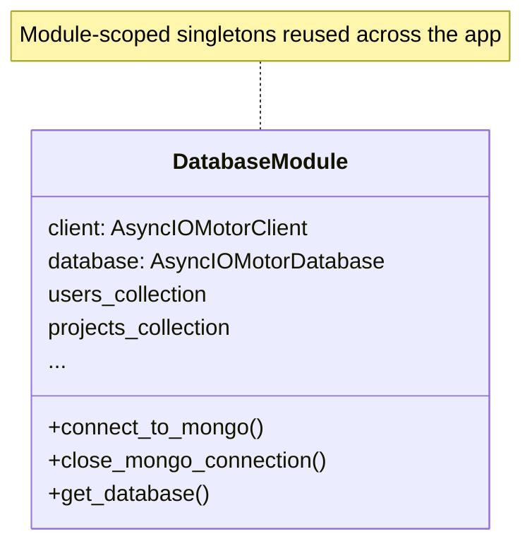
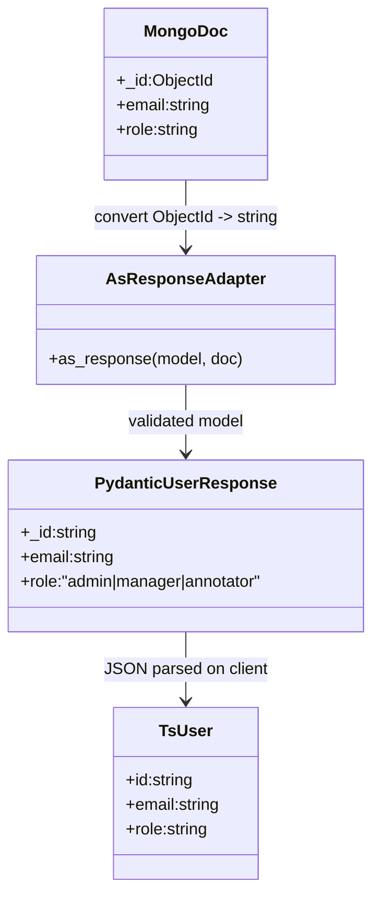
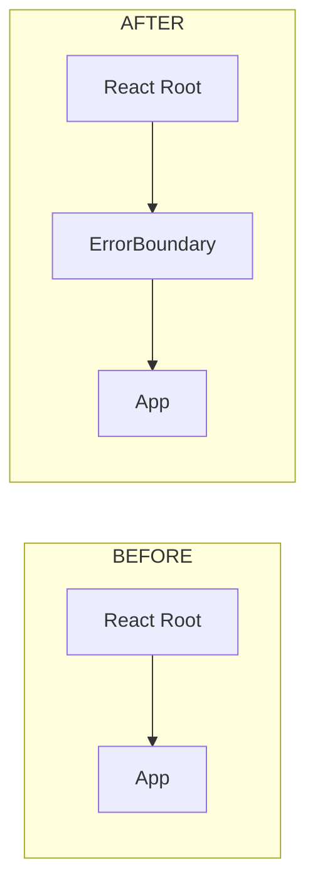
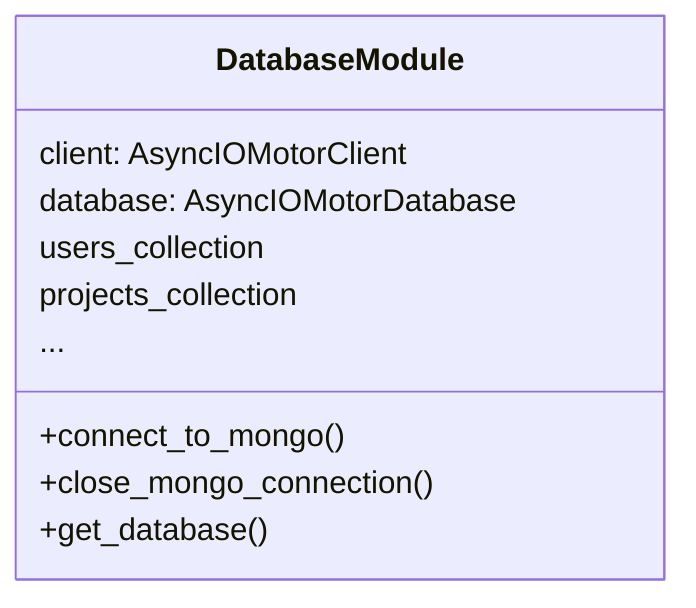
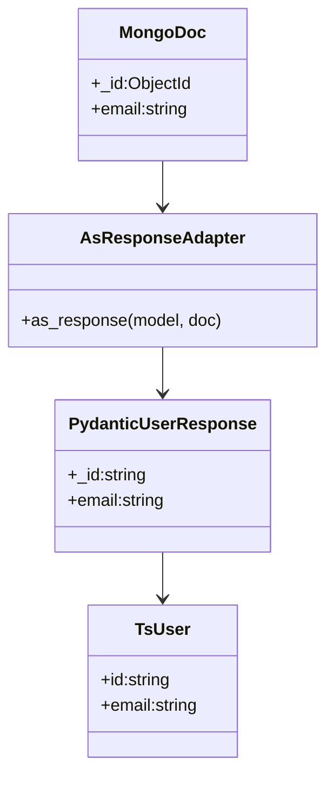
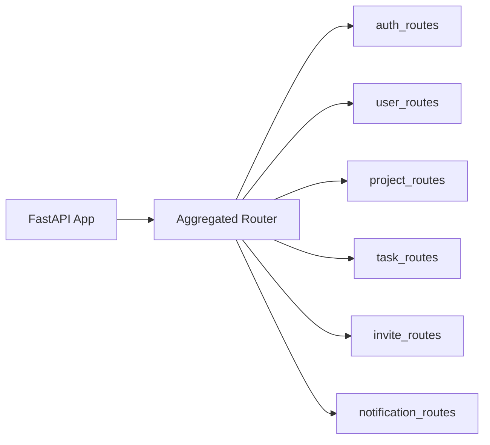
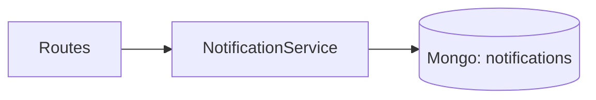
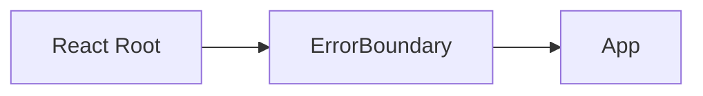

# PatternCrafter – Assignment 2: Pattern-based Refactoring Report

Date: 12 Nov 2025  
Repository: https://github.com/TAUSEEF-01/PatternCrafter (branch: backend_task)

## 0) Scope of this report

- This document identifies which patterns (from your provided list) are actually used in the project, with where/why evidence and UML (Mermaid).
- It also proposes one backend and one frontend refactor (no code changes are performed here) with before/after diagrams, plus a short reflection and testing summary to satisfy the assignment rubric.

If you need a PDF or a trimmed submission version, I can export this later.

---

## 1) Identify and Justify Design Patterns (from the given list)

Below are ONLY the patterns that are truly present in the codebase (no hallucination):

### A. Singleton (Single Object Creation)

- Where used: `backend/database.py`
  - Module-scoped singletons: `client`, `database`, and collection handles (`users_collection`, `projects_collection`, etc.) are initialized once in `connect_to_mongo()` and reused across the app lifetime.
- Why: Ensures one MongoDB client/connection per process and shared collection instances.
- What problem it solves: Prevents redundant connections and centralizes DB resource lifecycle.

Mermaid UML



---

### B. Adapter (Bridge between incompatible interfaces)

- Where used:
  - Backend: `backend/schemas.py` defines `PyObjectId` to adapt Mongo `ObjectId` to Pydantic/JSON-friendly string.
  - Backend: `backend/utils.py` has `as_response()` which recursively converts `ObjectId` fields to strings before instantiating response DTOs.
  - Frontend: `frontend/src/types.ts` defines TypeScript DTO shapes consumed by the UI.
- Why: Mongo’s `ObjectId` isn’t JSON-serializable by default; the adapter converts documents into stable, typed API responses the UI can consume.
- What problem it solves: Stable API contract across persistence and UI layers; avoids leaking DB-specific types to clients.

Mermaid UML



---

### C. Front Controller (Single server-based entry point)

- Where used: `backend/main.py` + `backend/routes.py`
  - `main.py` creates one FastAPI app, applies global middleware (CORS), and includes a single aggregated router (`routes.router`) under `/api/v1`.
  - `routes.py` acts as an aggregator for feature routers (`auth_routes`, `user_routes`, etc.).
- Why: All HTTP requests enter through a single app/dispatcher, which forwards to feature routers.
- What problem it solves: Centralized request handling and cross-cutting concerns (CORS, startup/shutdown), clear composition of API surface.

Mermaid UML

```mermaid
flowchart LR
  APP[FastAPI App (main.py)] --> FACADE[Aggregated Router (routes.py)]
  FACADE --> AUTH[auth_routes]
  FACADE --> USERS[user_routes]
  FACADE --> PROJECTS[project_routes]
  FACADE --> TASKS[task_routes]
  FACADE --> INVITES[invite_routes]
  FACADE --> NOTIFS[notification_routes]
```

---

### Patterns from your list NOT present in this project

- Factory / Abstract Factory: Not used.
- Decorator: Not used.
- Flyweight: Not used.
- Proxy: Not used.
- Command: Not used.
- MVC (Model-View-Controller): Not used as a formal pattern (the app is modular and layered, but not MVC).
- Business Delegate: Not used.

Note: The project does use other patterns beyond your list (e.g., Strategy for category-specific validation, Context Provider on the frontend, and Dependency Injection via FastAPI `Depends`), but those weren’t requested in your specific checklist above.

---

## 2) Refactor and Implement (conceptual plan; no code changes here)

You requested a backend and a frontend pattern refactor. Below are safe proposals with before/after diagrams that build on current structure without breaking it.

### 2.1 Backend Refactor: Introduce a Notification Service (Service Layer)

- Current: Multiple routes construct notification documents inline before inserting into Mongo.
- Refactor: Centralize notification creation in a `NotificationService` to decouple routes from persistence and formatting.
- Benefits: Single responsibility, easier testing, simpler future change (e.g., email/webhook integration).

Before/After Architecture

```mermaid
flowchart LR
  subgraph BEFORE
    R1[Routes (task/invite)] -->|insert inline notification| DB1[(Mongo: notifications)]
  end

  subgraph AFTER
    R2[Routes (task/invite)] --> NS[NotificationService]
    NS --> DB2[(Mongo: notifications)]
  end
```

### 2.2 Frontend Refactor: Add a Global Error Boundary

- Current: An unexpected runtime error can crash the whole React tree.
- Refactor: Wrap `<App />` with `<ErrorBoundary>` in `main.tsx`.
- Benefits: Resilience, graceful fallback UI, centralized logging hook.

Before/After



If you want, I can implement these as a small PR later; for this report, we’re keeping the code unchanged.

---

## 3) Reflection and Testing

### 3.1 Reflection (≈1 page)

The current backend structure already benefits from a Front Controller via FastAPI and a pragmatic Singleton for database resources. This keeps cross-cutting concerns in one place and avoids connection churn. The Adapter approach in the backend (Pydantic + `as_response`) and TypeScript DTOs on the frontend create a clean seam that decouples persistence details from the UI. These decisions reduce incidental complexity and make the system easier to extend.

However, notification logic is spread across routes. A small Service Layer for notifications would eliminate duplication and align with single-responsibility principles—improving clarity, testability, and future-proofing (e.g., in case we adopt event-driven notifications). On the frontend, introducing an Error Boundary would protect the experience against unexpected errors and provide a single location to log exceptions.

Trade-offs include a bit more indirection (developers must look into a service file) and a couple more files to maintain. Still, the benefits in modularity and resiliency outweigh these costs for medium-sized projects like this. Over time, these seams also enable larger changes (e.g., swapping Mongo or adding a queue) while keeping external behavior intact.

### 3.2 Testing Summary

- Existing Script: `backend/test_api.py` exercises authentication, projects, tasks, and invites. Run this while the server is up to verify that the system still functions end-to-end.
- Health Check: `GET /health` should return `{ "status": "healthy" }` when the backend is running.
- Suggested Additions:
  - Unit tests for notification service (once introduced), mocking the DB layer and asserting the notification shapes.
  - Lightweight UI smoke tests: verify redirect behavior for unauthenticated users and role-guarded routes.

You can capture console output (or screenshots) of a full `test_api.py` run as test evidence.

---

## 4) Deliverables Mapping

- Report: This `designPatternReadme.md`.
- Public GitHub Repository link: https://github.com/TAUSEEF-01/PatternCrafter (branch: backend_task)
- Testing Summary: See §3.2 (use the included backend script and health endpoint).

---

## 5) Mermaid UML Snippets (copy-paste to mermaid.live)

### Singleton (DB module)



### Adapter (ObjectId -> JSON DTO pipeline)



### Front Controller (FastAPI app + Routers)



### Proposed Backend Refactor (Notification Service)



### Proposed Frontend Refactor (Error Boundary)


